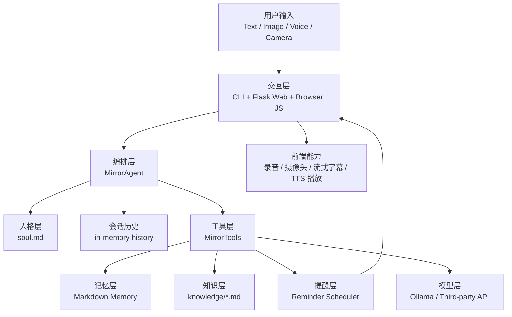
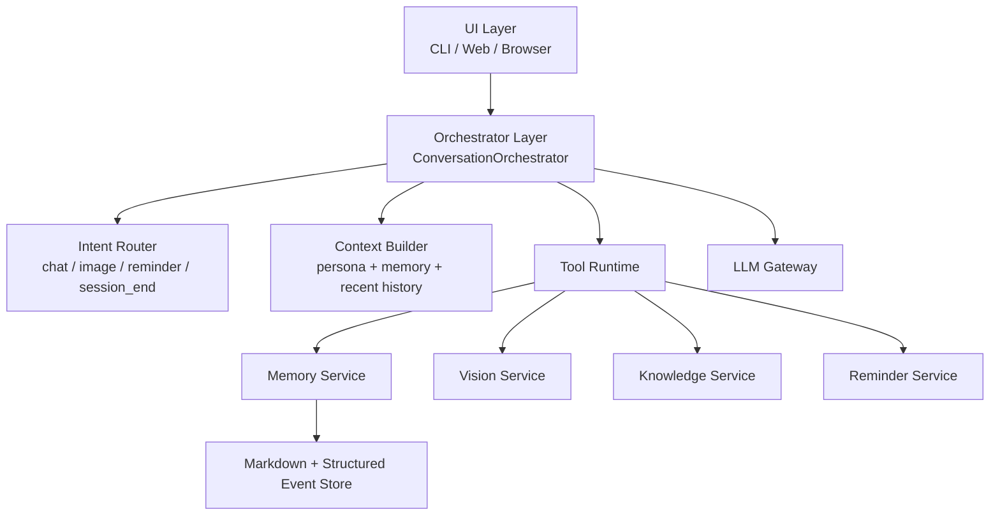

# Mirror Agent 技术方案

## 1. 文档目标

本文档用于说明 Mirror Agent 的当前技术基础、推荐目标架构、模块边界、关键数据流、数据设计、风险点与分阶段演进方案，供研发、产品和后续维护使用。

## 2. 技术目标

Mirror Agent 的技术方案需要同时满足以下目标：

1. 复用现有本地优先的工程基础。
2. 保持人格、记忆、工具、多模态交互的边界清晰。
3. 支持文字、图片、语音、镜头的统一编排。
4. 支持后续提醒持久化、记忆增强与趋势升级。
5. 在不引入重型基础设施的前提下，保留向更完整 personal agent 演进的空间。

## 3. 当前基础能力概览

当前仓库已经具备以下技术基础：

- `agent.py`：Agent 编排与 tool loop
- `tools.py`：工具注册与执行
- `memory.py`：Markdown Memory 读写
- `webapp.py`：Flask Web 服务
- `voice_input.py`：Whisper 转写与本地音频采集
- `voice_output.py`：TTS 生成与播放
- `reminders.py`：内存版提醒调度器
- `ollama_client.py` / `third_party_client.py`：模型 provider 适配层

这说明当前项目已经不是概念验证脚本，而是一个结构化的本地 Agent MVP。

## 4. 总体架构



## 5. 架构分层设计

### 5.1 交互层

职责：

- 承接用户输入
- 管理上传文件和前端状态
- 暴露本地 API
- 承接流式输出和提醒轮询

当前实现：

- CLI：适合开发调试
- Web：适合真实体验验证

设计原则：

- 交互层不直接做业务判断
- 交互层负责收集上下文并传给编排层

### 5.2 编排层

职责：

- 根据输入类型做路由
- 组装 system prompt
- 注入最近 memory 与短期 history
- 驱动模型与工具循环
- 统一限制输出风格与长度

当前核心能力：

- 文本聊天
- 图片路径识别
- 提醒请求解析
- 多模态上下文构建
- 结束会话触发 diary 写入

设计判断：

`MirrorAgent` 是当前系统的业务中枢，短期内应继续保留它作为主编排器，但中期应避免继续膨胀为巨型文件。

### 5.3 工具层

职责：

- 将模型可调用能力统一抽象为 function tools
- 执行记忆读写、知识检索、自拍分析、趋势分析和提醒创建

当前优点：

- 工具边界清晰
- 模型调用和本地能力调用被统一进同一套接口

当前问题：

- `tools.py` 同时承载了多模态分析、记忆总结、趋势逻辑与知识检索，后续容易继续膨胀

推荐演进：

- `memory_tools.py`
- `vision_tools.py`
- `knowledge_tools.py`
- `reminder_tools.py`

由 `MirrorTools` 继续扮演聚合注册器角色。

### 5.4 记忆层

职责：

- 提供用户长期画像
- 提供按日沉淀的 diary
- 提供跨周期 insights

当前优点：

- 可读
- 可手工编辑
- 对本地单用户 MVP 很友好

当前问题：

- 只在结束会话时集中写入，关键信息容易丢失
- profile 和 insight 主要依赖摘要推导，缺少更细粒度事件层

推荐演进：

- 保留 Markdown 作为展示与可编辑层
- 增加结构化事件索引层，用于支撑更稳的记忆提取与趋势分析

### 5.5 模型层

职责：

- 屏蔽不同 provider 的调用差异
- 为上层统一提供 OpenAI-compatible chat completions 接口形态

当前优点：

- 已适配 Ollama 与第三方接口
- 上层编排无需深度关心模型来源

当前问题：

- 文本模型与视觉模型的职责还不够清晰
- 第三方视觉兼容性存在通道差异风险

推荐演进：

- 明确拆分 `chat_model`、`vision_model`、`summary_model`
- 为不同任务配置不同 temperature、超时和降级策略

## 6. 推荐目标架构

建议在保留本地优先和现有模块习惯的基础上，演进为以下目标架构：



核心思想：

- 交互层只负责输入输出
- 编排层只负责路由、上下文和 tool loop
- 领域能力沉到底层 service
- 存储层从纯 Markdown 升级为“Markdown + 结构化索引”

## 7. 关键数据流

### 7.1 文本聊天流

1. 用户输入文本
2. Web/CLI 将文本发送给 `MirrorAgent`
3. `MirrorAgent` 组装人格、记忆、短期历史
4. 模型返回普通回复或 tool call
5. 如有 tool call，则执行并回填结果
6. 最终生成自然语言回复
7. 追加到会话 history

适用场景：

- 情绪接住
- 护肤知识问答
- 简单偏好记录

### 7.2 自拍分析流

1. 用户上传图片或直接发送本地图片路径
2. 系统读取图片并编码
3. 调用视觉模型执行结构化分析
4. 解析 JSON 结果
5. 生成自然语言回复
6. 将分析结果追加到 diary

适用场景：

- 观察今天脸部状态
- 做轻量历史对比

### 7.3 网页语音与镜头流

1. 浏览器录音
2. 录音结束时自动抓取当前帧和局部区域
3. 后端转写音频
4. 将文本问题和图像上下文一起发给 agent
5. agent 生成流式回复
6. 前端实时展示字幕
7. 生成并播放 TTS 音频

设计选择：

- 当前采用“每轮抓一帧”而不是持续视频流推理
- 这是更适合本地模型与 MVP 阶段的权衡

### 7.4 结束会话与写 diary 流

1. 用户说“晚安”或主动结束
2. agent 先完成收尾回复
3. 系统将本轮 history 交给记忆总结逻辑
4. 生成 diary、profile 更新与 insight 更新
5. 落盘到本地 memory

当前风险：

- 用户若直接关闭页面，可能跳过这个写入阶段

### 7.5 提醒流

1. 用户提出提醒意图
2. agent 解析提醒分钟数和文案
3. scheduler 将提醒存入内存
4. 前端轮询 `/api/reminders/due`
5. 到时返回提醒内容并生成音频

当前风险：

- 提醒重启即丢
- 无周期性规则
- 无任务恢复机制

## 8. 数据设计

### 8.1 当前存储结构

```text
memory/
  profile.md
  insights.md
  diary/
    YYYY-MM-DD.md
```

### 8.2 当前数据职责

- `profile.md`：稳定画像、偏好、长期信息
- `insights.md`：跨 7 天以上的模式
- `diary/*.md`：每日互动摘要与自拍分析

### 8.3 推荐新增结构化层

建议新增：

```text
memory/
  events/
    YYYY-MM-DD.jsonl
```

每条 event 可包含：

- timestamp
- event_type
- raw_user_text
- extracted_facts
- mood
- skin_signals
- reminder_request
- source

价值：

- 保持 Markdown 可读性
- 提升趋势分析与记忆写入的准确性
- 降低后续完全依赖大模型总结的波动

## 9. 接口设计

### 9.1 已有后端接口

- `POST /api/chat`
- `POST /api/image`
- `POST /api/voice-chat`
- `POST /api/voice-chat-stream`
- `GET /api/reminders/due`
- `POST /api/end`
- `GET /audio/<filename>`

### 9.2 推荐保留原则

- 文本接口和多模态接口分开，便于降级
- 流式接口单独保留，避免所有请求都走 streaming
- 提醒轮询在 MVP 可继续保留，后续再评估 SSE 或 WebSocket

## 10. 模块边界建议

### 10.1 推荐拆分

建议未来将以下职责从现有大文件中拆开：

- `conversation_orchestrator.py`
- `intent_router.py`
- `memory_service.py`
- `vision_service.py`
- `summary_service.py`
- `reminder_service.py`

### 10.2 目标边界

每个模块应满足：

- 单一职责明确
- 依赖方向清晰
- 可以单测
- 不需要读取过多其他模块内部细节

## 11. 关键问题与改造建议

### 11.1 Reminder 持久化

当前问题：

- 使用内存数组存储提醒，服务重启后全部丢失

建议方案：

- 引入本地持久化存储，可先用 JSON/SQLite
- 启动时恢复未完成提醒
- 增加状态字段：pending / delivered / cancelled

优先级：P0

### 11.2 Memory 写入时机

当前问题：

- 高价值信息主要依赖“结束会话时写入”

建议方案：

- 增加事件级即时提取
- 对命名、偏好、长期肤质信息即时更新 profile
- diary 继续保留会话级总结

优先级：P0

### 11.3 趋势分析过于规则化

当前问题：

- 目前主要是关键词计数和弱规则推断

建议方案：

- 基于结构化 events 做统计
- 结合 diary 和自拍分析结果输出周视图
- 把趋势分析从“工具兜底”升级为“显式产品能力”

优先级：P1

### 11.4 配置与敏感信息治理

当前问题：

- 敏感配置不应硬编码在默认配置中

建议方案：

- 环境变量唯一入口
- 本地 `.env.example`
- 启动时做配置校验和友好提示

优先级：P0

### 11.5 临时文件治理

当前问题：

- 上传文件和音频文件采用临时目录，但缺少清理策略

建议方案：

- 定时清理旧文件
- 为音频和图片设置生命周期
- 对 diary 中需要保留的分析结果，仅保留结构化摘要，不保留原始图片

优先级：P1

### 11.6 多会话隔离

当前问题：

- 当前是单用户、单全局 agent 实例

建议方案：

- MVP 继续单用户
- 若后续走产品化，需要引入 session_id 和每用户 memory 空间

优先级：P2

## 12. 性能与体验优化建议

### 12.1 模型延迟优化

- Whisper 模型常驻，避免重复加载
- 为摘要使用更轻模型
- 文本和视觉任务拆分不同模型配置

### 12.2 前端体验优化

- 保持流式字幕
- 优化录音失败、权限失败、自动播放失败文案
- 镜头模式下增加“当前正在看你”的更明确状态反馈

### 12.3 降级策略

- 视觉失败时降级为文字建议
- TTS 失败时保留文字与字幕
- 第三方 provider 失败时优先切回本地 provider

## 13. 安全与合规约束

### 13.1 内容安全

- 明确不是医疗诊断产品
- 所有视觉分析 prompt 都要保留“只做表面观察”的边界
- 出现明显异常时只给出就医建议，不给病名推断

### 13.2 数据安全

- 本地优先存储
- 敏感配置不写死
- 后续需补充清理机制和数据说明

## 14. 测试策略

### 14.1 当前基础

当前已有较完整的 `unittest` 覆盖：

- agent 行为
- web 接口
- memory 模块
- tools 模块
- 前端契约

### 14.2 推荐补强

- reminder 持久化恢复测试
- event-level memory 提取测试
- 配置校验测试
- 临时文件清理测试
- provider 降级测试

## 15. 分阶段实施建议

### 阶段一：稳定化

目标：

- 让系统从可演示变成可持续使用

交付：

- 移除硬编码密钥
- reminder 持久化
- memory 即时写入关键事件
- 临时文件治理

### 阶段二：连续价值增强

目标：

- 让“它记得我”从感觉变成系统能力

交付：

- event store
- 近 7 天状态摘要
- 自拍历史对比增强
- 提醒自然语言增强

### 阶段三：产品化演进

目标：

- 让架构可以支撑更复杂的 personal agent 形态

交付：

- 编排层拆分
- 多 session 隔离
- 数据管理面板
- 更细化的模型任务编排

## 16. 推荐结论

Mirror Agent 当前技术路线是成立的，尤其适合本地优先、单用户、多模态陪伴型 Agent 的 MVP。

最重要的不是推翻重做，而是在现有架构上完成三件事：

1. 把“会跑”升级成“可靠”。
2. 把“有记忆”升级成“记得更稳”。
3. 把“多模态输入”升级成“持续价值闭环”。

从技术上看，这个项目最适合走“小步演进、边界收敛、能力沉底”的路线，而不是一次性引入复杂基础设施。
